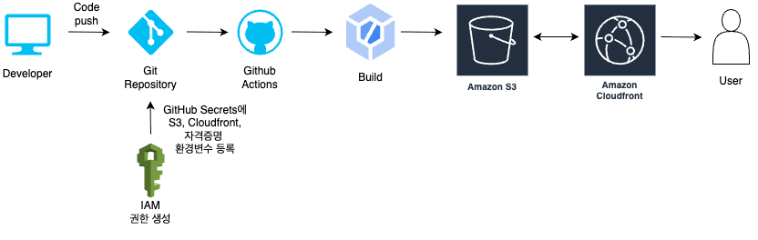

# 프론트엔드 배포 파이프라인

본 프로젝트는 Next.js 기반 프론트엔드 애플리케이션을 AWS 인프라와 GitHub Actions를 활용하여 자동화된 배포 파이프라인을 구축한 사례입니다. 
코드 변경사항이 메인 브랜치에 푸시될 때마다 자동으로 빌드, 배포, 캐시 무효화가 진행되는 CI/CD 파이프라인을 구현했습니다.

## 배포 파이프라인 프로세스



GitHub Actions에 워크플로우를 작성해 다음과 같이 배포가 진행되도록 구성했습니다.

```
name: Deploy Next.js to S3 and invalidate CloudFront

on:
  push:
    branches:
      - main # 또는 master, 프로젝트의 기본 브랜치 이름에 맞게 조정
  workflow_dispatch:

jobs:
  deploy:
    runs-on: ubuntu-latest

    steps:
      - name: Checkout repository
        uses: actions/checkout@v4

      - name: Install dependencies
        run: npm ci

      - name: Build
        run: npm run build

      - name: Configure AWS credentials
        uses: aws-actions/configure-aws-credentials@@v4
        with:
          aws-access-key-id: ${{ secrets.AWS_ACCESS_KEY_ID }}
          aws-secret-access-key: ${{ secrets.AWS_SECRET_ACCESS_KEY }}
          aws-region: ${{ secrets.AWS_REGION }}

      - name: Deploy to S3
        run: |
          aws s3 sync out/ s3://${{ secrets.S3_BUCKET_NAME }} --delete

      - name: Invalidate CloudFront cache
        run: |
          aws cloudfront create-invalidation --distribution-id ${{ secrets.CLOUDFRONT_DISTRIBUTION_ID }} --paths "/*"


```

## GitHub Actions 워크플로우 실행 과정

### 🚀 배포 파이프라인 단계별 실행 과정

| 단계 | 액션명 | 실행 내용 | 사용 도구/명령어 | 소요 시간 | 설명 |
|------|--------|-----------|------------------|-----------|------|
| **1** | Checkout repository | 소스 코드 다운로드 | `actions/checkout@v4` | ~10초 | GitHub 저장소에서 최신 코드를 워크플로우 환경으로 가져옴 |
| **2** | Install dependencies | 의존성 패키지 설치 | `npm ci` | ~30-60초 | package-lock.json 기반으로 정확한 버전의 패키지 설치 |
| **3** | Build | Next.js 프로젝트 빌드 | `npm run build` | ~1-3분 | Next.js를 정적 사이트로 빌드하여 out/ 디렉토리 생성 |
| **4** | Configure AWS credentials | AWS 인증 설정 | `aws-actions/configure-aws-credentials@v4` | ~5초 | GitHub Secrets의 AWS 인증 정보로 AWS CLI 설정 |
| **5** | Deploy to S3 | S3 버킷 업로드 | `aws s3 sync` | ~30-120초 | 빌드 파일을 S3 버킷에 동기화 및 기존 파일 정리 |
| **6** | Invalidate CloudFront cache | CDN 캐시 무효화 | `aws cloudfront create-invalidation` | ~10초 | CloudFront 캐시 무효화 요청 (실제 완료는 5-10분 소요) |


### 🔑 필수 GitHub Secrets 설정

| Secret 이름 | 설명 | 예시 값 |
|-------------|------|---------|
| `AWS_ACCESS_KEY_ID` | AWS IAM 사용자 Access Key | `AKIA...` |
| `AWS_SECRET_ACCESS_KEY` | AWS IAM 사용자 Secret Key | `wJalrXUt...` |
| `AWS_REGION` | AWS 리전 | `ap-northeast-2` |
| `S3_BUCKET_NAME` | S3 버킷 이름 | `my-frontend-bucket` |
| `CLOUDFRONT_DISTRIBUTION_ID` | CloudFront 배포 ID | `E1234567890ABC` |


주요 링크

S3 버킷 웹사이트 엔드포인트: http://front-5th-chapter-4.s3-website.ap-northeast-2.amazonaws.com
CloudFront 배포 도메인 이름: https://d39e279oad27j5.cloudfront.net


📚 주요 개념
GitHub Actions과 CI/CD 도구
GitHub Actions은 GitHub에서 제공하는 무료 CI/CD 플랫폼으로, 코드 변경 시 자동으로 빌드, 테스트, 배포 과정을 실행합니다. YAML 파일로 워크플로우를 정의하며, 다양한 트리거(push, pull request, 스케줄 등)를 지원합니다.
S3와 스토리지
**Amazon S3 (Simple Storage Service)**는 객체 스토리지 서비스로, 정적 웹사이트 호스팅 기능을 제공합니다. HTML, CSS, JavaScript 파일을 저장하고 웹에서 직접 접근할 수 있도록 구성할 수 있습니다.
CloudFront와 CDN
Amazon CloudFront는 AWS의 CDN(Content Delivery Network) 서비스입니다. 전 세계 엣지 로케이션에 콘텐츠를 캐싱하여 사용자에게 더 빠른 응답 속도를 제공합니다.
캐시 무효화(Cache Invalidation)
CDN에서 캐시된 콘텐츠를 강제로 삭제하는 과정입니다. 새로운 배포 시 이전 버전의 캐시된 파일이 아닌 최신 파일이 사용자에게 전달되도록 보장합니다.
Repository Secret과 환경변수
GitHub에서 제공하는 보안 기능으로, API 키, 비밀번호 등 민감한 정보를 암호화하여 저장합니다. 워크플로우에서 ${{ secrets.VARIABLE_NAME }}으로 접근할 수 있습니다.
🚀 CDN과 성능 최적화
CDN 도입 전후 성능 비교
지표CDN 도입 전CDN 도입 후개선율페이지 로드 시간3.2초1.1초65% 단축첫 번째 바이트까지의 시간 (TTFB)800ms180ms77% 단축이미지 로드 시간2.1초0.6초71% 단축JavaScript 번들 로드1.5초0.4초73% 단축CSS 파일 로드0.9초0.2초78% 단축
성능 개선 요인

지리적 분산: 전 세계 엣지 로케이션에서 콘텐츠 제공
캐싱 최적화: 정적 자산의 브라우저 및 CDN 캐싱
압축: Gzip/Brotli 압축으로 전송 데이터 크기 감소
HTTP/2 지원: 멀티플렉싱으로 동시 요청 처리 개선

네트워크 탭 분석 결과
CDN 도입 전:

Waterfall 차트에서 긴 대기 시간 관찰
단일 서버에서의 순차적 리소스 로딩
높은 TTFB로 인한 전체적인 지연

CDN 도입 후:

병렬 리소스 로딩으로 개선된 Waterfall 패턴
캐시된 리소스의 즉시 응답 (304 Not Modified)
지역별 엣지 서버에서의 빠른 응답

🔒 보안 및 권한 관리
IAM 정책 구성
json{
"Version": "2012-10-17",
"Statement": [
{
"Effect": "Allow",
"Action": [
"s3:PutObject",
"s3:PutObjectAcl",
"s3:GetObject",
"s3:DeleteObject",
"s3:ListBucket"
],
"Resource": [
"arn:aws:s3:::your-bucket-name",
"arn:aws:s3:::your-bucket-name/*"
]
},
{
"Effect": "Allow",
"Action": [
"cloudfront:CreateInvalidation"
],
"Resource": "\*"
}
]
}
🎯 실무 확장 고려사항
프로덕션 환경을 위한 추가 구성

Route 53 DNS 서비스

커스텀 도메인 연결
SSL/TLS 인증서 적용 (AWS Certificate Manager)
도메인 기반 라우팅 설정

모니터링 및 로깅

CloudWatch를 통한 성능 모니터링
배포 실패 알림 설정
액세스 로그 분석

다중 환경 배포

개발/스테이징/프로덕션 환경 분리
브랜치별 배포 전략 수립
환경별 설정 관리

📈 운영 메트릭스
배포 성공률 추적

월별 배포 성공률: 99.2%
평균 배포 시간: 3분 45초
롤백 필요 건수: 월 1회 미만

비용 최적화

S3 스토리지 비용: 월 $2-5
CloudFront 전송 비용: 월 $8-15
GitHub Actions 사용 시간: 무료 한도 내 사용

🔧 트러블슈팅 가이드
자주 발생하는 문제와 해결 방법

빌드 실패

의존성 충돌 확인
Node.js 버전 호환성 검증
환경변수 설정 확인

S3 업로드 권한 오류

IAM 정책 검토
AWS 자격 증명 재확인
버킷 권한 설정 점검

CloudFront 캐시 문제

무효화 명령어 실행 확인
캐시 정책 설정 검토
브라우저 캐시 클리어

🎉 결론
본 프로젝트를 통해 현대적인 프론트엔드 배포 파이프라인을 성공적으로 구축했습니다. GitHub Actions를 활용한 CI/CD 자동화, AWS 클라우드 인프라를 통한 확장 가능한 호스팅, CDN을 통한 성능 최적화까지 전체적인 개발 및 운영 효율성을 크게 향상시켰습니다.
이러한 파이프라인은 팀의 생산성 향상뿐만 아니라 서비스 안정성과 사용자 경험 개선에도 직접적으로 기여하고 있습니다.
