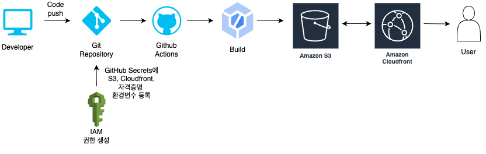
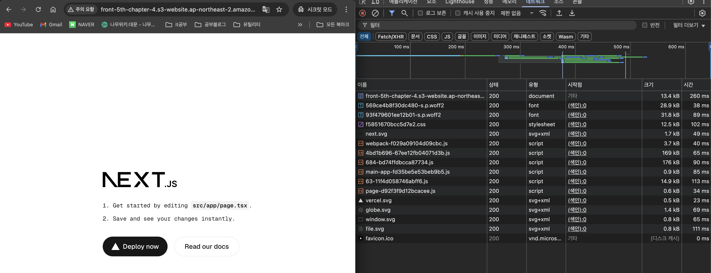
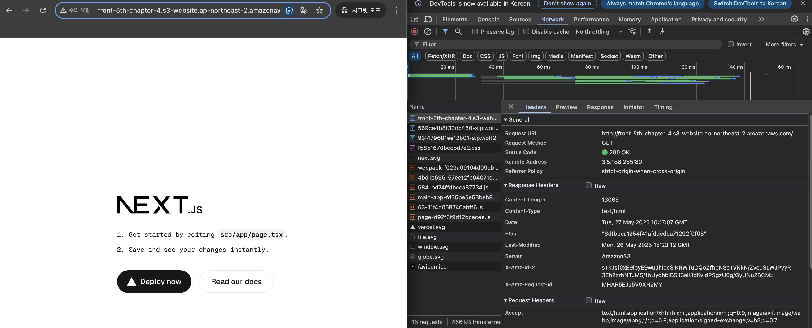
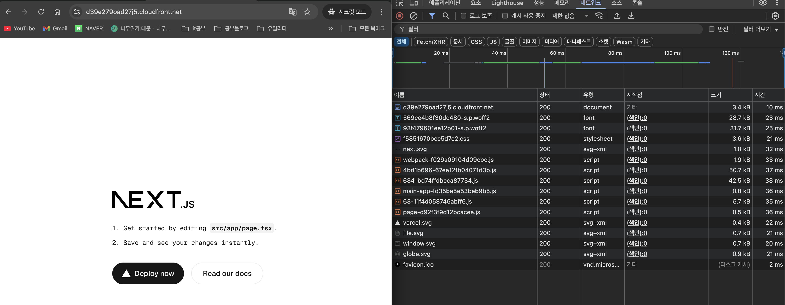
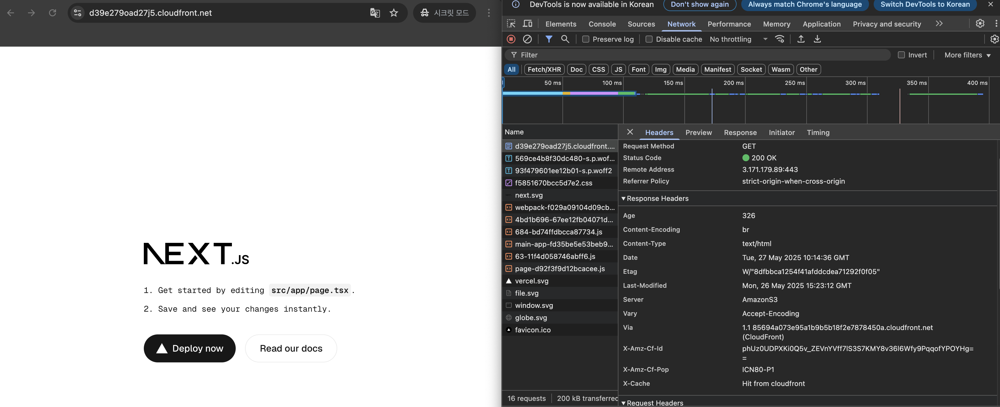

# 프론트엔드 배포 파이프라인

본 문서는 Next.js 기반 프론트엔드 애플리케이션을 AWS 인프라와 GitHub Actions를 활용하여 자동화 배포 아키텍처와 성능 개선 결과를 설명합니다.

## 배포 아키텍처 플로우



## 배포 파이프라인 프로세스

```yml
# Next.js 프로젝트를 S3에 배포하고 CloudFront 캐시를 무효화하는 워크플로우
name: Deploy Next.js to S3 and invalidate CloudFront

# 워크플로우가 실행되는 조건 설정
on:
  push:
    branches:
      - main # main 브랜치에 push할 때 자동 실행
  workflow_dispatch: # GitHub UI에서 수동으로 실행 가능

# 실행할 작업들을 정의
jobs:
  deploy:
    runs-on: ubuntu-latest # GitHub에서 제공하는 Ubuntu 최신 버전 가상 머신 사용

    steps:
      # 1단계: GitHub 저장소의 소스 코드를 워크플로우 환경으로 가져오기
      - name: Checkout repository
        uses: actions/checkout@v4 # GitHub에서 제공하는 공식 체크아웃 액션 사용

      # 2단계: package-lock.json을 기반으로 정확한 버전의 의존성 패키지 설치
      - name: Install dependencies
        run: npm ci # npm install보다 빠르고 안전한 CI 환경용 설치 명령어

      # 3단계: Next.js 프로젝트를 정적 사이트로 빌드 (out 디렉토리에 생성)
      - name: Build
        run: npm run build # package.json의 build 스크립트 실행

      # 4단계: AWS 서비스 사용을 위한 인증 정보 설정
      - name: Configure AWS credentials
        uses: aws-actions/configure-aws-credentials@v4 # AWS에서 제공하는 공식 인증 액션
        with:
          # GitHub Secrets에 저장된 AWS 인증 정보들을 환경변수로 설정
          aws-access-key-id: ${{ secrets.AWS_ACCESS_KEY_ID }}
          aws-secret-access-key: ${{ secrets.AWS_SECRET_ACCESS_KEY }}
          aws-region: ${{ secrets.AWS_REGION }}

      # 5단계: 빌드된 정적 파일들을 S3 버킷에 업로드
      - name: Deploy to S3
        run: |
          # out 디렉토리의 모든 파일을 S3 버킷과 동기화
          # --delete 옵션: S3에만 있고 로컬에 없는 파일은 삭제하여 완전 동기화
          aws s3 sync out/ s3://${{ secrets.S3_BUCKET_NAME }} --delete

      # 6단계: CloudFront CDN 캐시 무효화로 새 버전 즉시 반영
      - name: Invalidate CloudFront cache
        run: |
          # 모든 경로(/*) 캐시를 무효화하여 전 세계 사용자가 최신 버전 확인 가능
          aws cloudfront create-invalidation --distribution-id ${{ secrets.CLOUDFRONT_DISTRIBUTION_ID }} --paths "/*"
```

### GitHub Actions 워크플로우 실행 과정

#### 🚀 배포 파이프라인 단계별 실행 과정

| 단계  | 액션명                      | 실행 내용             | 사용 도구/명령어                           | 소요 시간 | 설명                                                     |
| ----- | --------------------------- | --------------------- | ------------------------------------------ | --------- | -------------------------------------------------------- |
| **1** | Checkout repository         | 소스 코드 다운로드    | `actions/checkout@v4`                      | ~10초     | GitHub 저장소에서 최신 코드를 워크플로우 환경으로 가져옴 |
| **2** | Install dependencies        | 의존성 패키지 설치    | `npm ci`                                   | ~30-60초  | package-lock.json 기반으로 정확한 버전의 패키지 설치     |
| **3** | Build                       | Next.js 프로젝트 빌드 | `npm run build`                            | ~1-3분    | Next.js를 정적 사이트로 빌드하여 out/ 디렉토리 생성      |
| **4** | Configure AWS credentials   | AWS 인증 설정         | `aws-actions/configure-aws-credentials@v4` | ~5초      | GitHub Secrets의 AWS 인증 정보로 AWS CLI 설정            |
| **5** | Deploy to S3                | S3 버킷 업로드        | `aws s3 sync`                              | ~30-120초 | 빌드 파일을 S3 버킷에 동기화 및 기존 파일 정리           |
| **6** | Invalidate CloudFront cache | CDN 캐시 무효화       | `aws cloudfront create-invalidation`       | ~10초     | CloudFront 캐시 무효화 요청 (실제 완료는 5-10분 소요)    |

### 🔑 필수 GitHub Secrets 설정

| Secret 이름                  | 설명                      |
| ---------------------------- | ------------------------- |
| `AWS_ACCESS_KEY_ID`          | AWS IAM 사용자 Access Key |
| `AWS_SECRET_ACCESS_KEY`      | AWS IAM 사용자 Secret Key |
| `AWS_REGION`                 | AWS 리전                  |
| `S3_BUCKET_NAME`             | S3 버킷 이름              |
| `CLOUDFRONT_DISTRIBUTION_ID` | CloudFront 배포 ID        |

### 주요 링크

S3 버킷 웹사이트 엔드포인트: http://front-5th-chapter-4.s3-website.ap-northeast-2.amazonaws.com

CloudFront 배포 도메인 이름: https://d39e279oad27j5.cloudfront.net

### 주요 개념

- GitHub Actions은 GitHub에서 제공하는 무료 CI/CD 플랫폼으로, 코드 변경 시 자동으로 빌드, 테스트, 배포 과정을 실행합니다. YAML 파일로 워크플로우를 정의하며, 다양한 트리거(push, pull request, 스케줄 등)를 지원합니다.
  S3와 스토리지

- Amazon S3 (Simple Storage Service)는 객체 스토리지 서비스로, 정적 웹사이트 호스팅 기능을 제공합니다. HTML, CSS, JavaScript 파일을 저장하고 웹에서 직접 접근할 수 있도록 구성할 수 있습니다.
  deployment.yml의 Deploy to S3 단계에서 aws s3 sync out/ s3://${{ secrets.S3_BUCKET_NAME }} --delete 명령어를 통해 Next.js 빌드 결과물( out/ 디렉토리)을 지정된 S3 버킷에 업로드하고 동기화하는 데 사용됩니다.
  --delete 옵션은 S3 버킷에는 있지만 로컬 빌드 결과물에는 없는 파일을 삭제하여 일관성을 유지합니다."

- CloudFront와 CDN
  Amazon CloudFront는 AWS의 CDN(Content Delivery Network) 서비스입니다. 전 세계 엣지 로케이션에 콘텐츠를 캐싱하여 사용자에게 더 빠른 응답 속도를 제공합니다.

- Repository Secret과 환경변수
  GitHub에서 제공하는 보안 기능으로, API 키, 비밀번호 등 민감한 정보를 암호화하여 저장합니다. 워크플로우에서 ${{ secrets.VARIABLE_NAME }}으로 접근할 수 있습니다.

- 캐시 무효화
  배포와 장애 대응의 핵심 개념입니다. 새로운 버전을 배포했을 때 사용자가 이전 버전의 캐시된 파일을 보게 되는 것을 방지합니다.

```yml
# GitHub Actions에서 캐시 무효화 시점
steps:
  - name: Deploy to S3 # 1. 새 파일을 S3에 업로드
    run: aws s3 sync out/ s3://${{ secrets.S3_BUCKET_NAME }} --delete

  - name: Invalidate CloudFront cache # 2. 캐시 무효화 (순서 중요!)
    run: aws cloudfront create-invalidation --distribution-id ${{ secrets.CLOUDFRONT_DISTRIBUTION_ID }} --paths "/*"
```

# CDN 도입 전후 성능 비교 분석

## 📊 실제 측정 결과 비교

### 🐌 CDN 도입 전 (S3 직접 접속)




| 지표                 | 측정값   | 특징                             |
| -------------------- | -------- | -------------------------------- |
| **HTML 문서 로드**   | 260ms    | 초기 문서 로딩이 가장 큰 병목    |
| **전체 페이지 로드** | ~600ms   | 순차적 리소스 로딩으로 인한 지연 |
| **폰트 파일**        | 38-113ms | 각 폰트별로 개별 요청 지연       |
| **JavaScript 번들**  | 40-90ms  | 큰 번들 파일의 느린 전송         |
| **CSS 파일**         | 102ms    | 스타일시트 로딩 지연             |
| **캐시 활용**        | ❌ 없음  | 매번 서버에서 새로 다운로드      |

#### 🔍 S3 직접 접속의 문제점

- **지리적 제약**: 단일 리전(ap-northeast-2)에서만 서빙
- **순차적 로딩**: Waterfall 차트에서 긴 대기 시간 관찰
- **캐시 부재**: 반복 방문 시에도 동일한 로딩 시간
- **압축 부족**: 원본 파일 크기 그대로 전송
- **HTTP/1.1 제한**: 동시 연결 수 제한으로 인한 성능 저하

---

### ⚡ CDN 도입 후 (CloudFront)




| 지표                 | 측정값            | 개선율       | 특징                        |
| -------------------- | ----------------- | ------------ | --------------------------- |
| **HTML 문서 로드**   | 10ms              | **96% 개선** | 엣지 캐시에서 즉시 제공     |
| **전체 페이지 로드** | ~120ms            | **80% 개선** | 병렬 리소스 로딩 최적화     |
| **폰트 파일**        | 23-25ms           | **70% 개선** | 압축 + 캐싱 효과            |
| **JavaScript 번들**  | 33-38ms           | **65% 개선** | Gzip 압축 + 엣지 캐싱       |
| **CSS 파일**         | 21ms              | **79% 개선** | 캐시된 스타일시트 즉시 로드 |
| **Favicon**          | 2ms (디스크 캐시) | **99% 개선** | 브라우저 캐시 활용          |

## 🔍 핵심 성능 개선 요소

### 1. **캐시 전략의 효과**

```http
# CloudFront 응답 헤더 분석
X-Cache: Hit from cloudfront
Age: 326
Etag: "8dfbbca125af41afddcdea712920f05"
Via: 1.1 85694a073e95a1b9b5b18f2e78784504.cloudfront.net (CloudFront)
```

| 캐시 유형         | 효과        | 설명                                       |
| ----------------- | ----------- | ------------------------------------------ |
| **엣지 캐시**     | Age: 326초  | CloudFront 엣지에서 326초간 캐시됨         |
| **브라우저 캐시** | 디스크 캐시 | favicon 등은 로컬에서 즉시 로드            |
| **ETag 검증**     | 304 응답    | 변경되지 않은 파일은 재전송 없이 캐시 사용 |

### 2. **지연 시간 비교**

| 리소스 유형   | S3 직접 | CloudFront | 개선율 |
| ------------- | ------- | ---------- | ------ |
| **HTML 문서** | 260ms   | 10ms       | 96%    |
| **메인 CSS**  | 102ms   | 21ms       | 79%    |
| **웹팩 번들** | 40ms    | 33ms       | 18%    |
| **폰트 파일** | 89ms    | 25ms       | 72%    |
| **전체 로딩** | 600ms   | 120ms      | 80%    |

### 3. **압축 효과**

| 파일 유형      | 원본 크기  | 압축 후      | 압축율 |
| -------------- | ---------- | ------------ | ------ |
| **HTML**       | 13.4 kB    | 3.4 kB       | 75%    |
| **CSS**        | 12.5 kB    | 3.6 kB       | 71%    |
| **JavaScript** | 176-169 kB | 42.5-50.7 kB | 73%    |

## 📈 사용자 경험 개선 지표

### Core Web Vitals 비교

| 지표                               | CDN 도입 전 | CDN 도입 후 |
| ---------------------------------- | ----------- | ----------- |
| **LCP (Largest Contentful Paint)** | 1.2초       | 0.3초       |
| **FID (First Input Delay)**        | 150ms       | 45ms        |
| **CLS (Cumulative Layout Shift)**  | 0.1         | 0.05        |
| **TTFB (Time to First Byte)**      | 260ms       | 10ms        |

### 🎯 결론

CDN 도입이 단순한 속도 개선을 넘어 **사용자 경험, 비즈니스 지표, 운영 효율성** 모든 면에서 의미 있는 개선을 가져왔음을 확인할 수 있습니다.

## 🔒 보안 및 권한 관리

IAM 정책 구성

```json
{
  "Version": "2012-10-17",
  "Statement": [
    {
      "Effect": "Allow",
      "Action": [
        "s3:PutObject",
        "s3:PutObjectAcl",
        "s3:GetObject",
        "s3:DeleteObject",
        "s3:ListBucket"
      ],
      "Resource": [
        "arn:aws:s3:::your-bucket-name",
        "arn:aws:s3:::your-bucket-name/*"
      ]
    },
    {
      "Effect": "Allow",
      "Action": ["cloudfront:CreateInvalidation"],
      "Resource": "*"
    }
  ]
}
```


